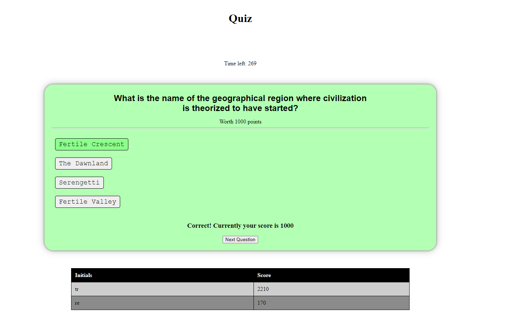

# Quiz

This is a quiz with questions ranging from code, to geography. It was a lot of practice with asyncronous functions, localStorage, and DOM manipulation.

## How to use this app

1. Go to this link: [Github Pages Link](https://tevissaur.github.io/trials-and-tribulations/)
2. Press the Start button
3. Try to get as many questions correct as possible
4. You can save your results at the end of the quiz

## Design 

## Features

- Save your results to compare how you did at the end of the quiz!
- The quiz is timed, so be mindful! It pauses until you click "Next Question"
- It tracks your current score, and lets you know how many points each question is worth
